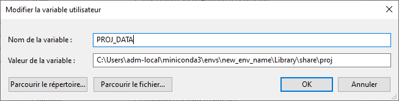

<div style="text-align: center;">
    <h1>Gambia indicators</h1>
</div>


This repo allows you to request data on 

## Features

- Request Data on openmeteo
- Calculate scores for each variable
- Organize the score by periods
- Make raster from the score 

## Install
If you don't have any miniconda environnment yet you should follow the following instruction. Else you don't need to create any environnment, you only have to activate it, so start from the 2nd point of the Environnment part.
You should install miniconda to not have any problem with the installation as it will contain everything you need and well separate from anything else that could interfer. Interence between packages is the most annoying problem when making installation.

## Environment

If you don't have miniconda install it, and set it up correctly.

1. Add the conda-forge channel to the conda avaiblable installs repo
```
conda config --add channels conda-forge
```

2. Create your conda environment with the YAML configuration provided
```
conda create -n new_env_name python=3.12
```

3. Activate it
```
conda activate new_env_name
```


4. Install GDAL from this new channel
```
conda install gdal
```

5. Install all the other packages with pip
```
pip install -r requirements.txt
```

6. If you get this kind of error :

    <span style="color:red">rasterio.errors.CRSError: The EPSG code is unknown. PROJ: proj_create_from_database: Cannot find proj.db</span>

    Then, it means that your system does not know where to find the corresponding file so you need to help him finding it.
    In order to do that, you need to find the file proj.db in your conda virtual environnment.
    This file is always located at the same place. If you built everything like me this file is located in the following folder: 

    <span style="color:green">C:\Users\adm-local\miniconda3\envs\new_env_name\Library\share\proj</span>

    If you built your environnment with a different name, you just need to change the name of it in the path.
    With this you need to create a new environnement variable named PROJ_DATA with this path.
    


If you are struggling to launch the code maybe you should try to reopen VSCode. It can solve numerous troubles.


## 1 - Make all the requests
```
python .\data_request\request.py
```
This command allows you to get the whole dataset. Without it, the next command will not produce anything.

## 2 - Create all the graph and score CSV file

```
python .\main.py
```
This command creates all the score plots from the dataset, and it creates huge CSV file with all the scores as well. This CSV file will be necessary for the last part that consists in creating the score rasters for each period.

## 3 - Make a raster viz
```
python .\rasterization\raster_from_point.py    
```
It creates the score rasters for each period. In order to do this you need to have previously run 1 and 2, otherwise you will not be able to create the rasters.

## Advice
If this is the first time you are running the code please you need to respect the order of the previous command.

